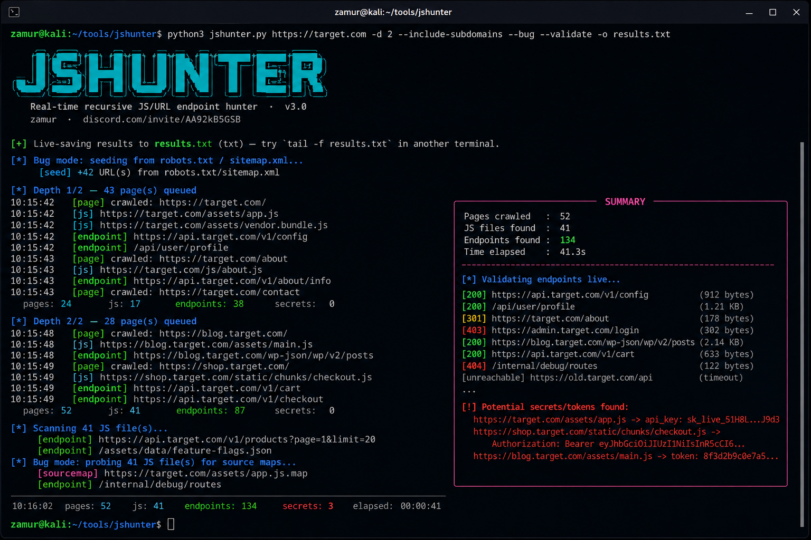

# jshunter

Real-time recursive JS/URL endpoint discovery tool.

Most "JS endpoint finder" scripts out there lean on Wayback Machine
snapshots, which means whatever you find is only as current as the last
crawl someone else did — could be months old. jshunter skips that and
hits the live target directly: it walks pages N levels deep, collects
every `<script src>` and inline `<script>` block along the way, then
regex-mines each JS file for paths, full URLs, and `fetch()` / `axios()`
calls.

Everything gets written to disk the moment it's found (`--out`), not
batched and dumped at the end — so a Ctrl+C or the target starting to
block you mid-scan doesn't cost you the results you already had.

```
$ python3 jshunter.py https://target.com -d 3 -o results.txt
[+] Live-saving results to results.txt (txt) — try `tail -f results.txt` in another terminal.

[*] Depth 1/3 — 1 page(s) queued
    [page] crawled: https://target.com
    [js] https://target.com/static/app.bundle.js
    [endpoint] https://target.com/api/v1/users
  pages:12   js:8   endpoints:47  secrets:0
```
<p align="center">
  
</p>

## Features

- **Recursive crawling** — `-d N` follows links N levels deep instead of
  scanning a single page
- **Scope control** — single-host by default; `--include-subdomains` to
  cover the whole `*.target.com` estate; `--external` to remove domain
  restriction entirely
- **Real-time output** — results stream to `--out` as they're discovered,
  safe to `tail -f` while it's running
- **JS + inline script + `<a href>` parsing** — not just external `.js`
  files, also inline `<script>` blocks and links to new pages to crawl
- **API call detection** — picks up `fetch()`, `axios.get/post()`,
  `$.ajax()` calls that plain URL regexes usually miss
- **Bug mode (`--bug`)** — seeds the crawl from `robots.txt` and
  `sitemap.xml`, and probes every JS file for an exposed `.js.map`
  source map to mine for extra routes
- **Headless render mode (`--render`)** — uses a real Chromium browser
  (via Playwright) instead of raw HTTP requests. It actually executes
  the page's JavaScript, so it sees routes and content that only exist
  after a React/Vue/Angular app renders, and records every
  `fetch()`/XHR call the app fires while loading. This is the mode you
  want for modern SPAs — the default HTTP-only crawl can't see anything
  that isn't in the server's raw HTML response.
- **Endpoint validation** — `--validate` hits every discovered endpoint
  and reports its live status code
- **Secret scanning** — `--secrets` flags likely hardcoded API keys /
  tokens sitting in JS
- **Resume support** — `--resume` picks up where a previous `--out` run
  left off instead of rediscovering everything
- **Proxy support** — `--proxy` routes traffic through Burp or anything
  else listening on a local port
- **Adaptive backoff** — automatically slows down when the target starts
  responding with 429/403
- **Nuclei-ready output** — `--nuclei-out` writes a clean, deduped URL
  list for `nuclei -l`
- **JSON Lines output** — `--format json` for piping straight into other
  tooling

## Install

```bash
git clone https://github.com/zamurpy/jshunter
cd jshunter
pip install requests beautifulsoup4 --break-system-packages
```

Works fine on Termux (Android) — that's what it was actually built and
tested on day to day.

### Optional: headless render mode (`--render`)

For SPAs (React/Vue/Angular/Svelte), the default HTTP crawl can't see
anything that only appears after JavaScript runs. `--render` fixes that
by driving a real Chromium instance:

```bash
pip install playwright --break-system-packages
playwright install chromium
```

It's slower and heavier than the default mode (a real browser has to
load and execute every page), and runs single-threaded — Playwright's
sync API can't be shared across worker threads safely, so rendering is
sequential by design rather than parallel. Use it when you know or
suspect the target is a client-rendered app; skip it for traditional
server-rendered sites where it just adds overhead for no benefit.

## Usage

```bash
python3 jshunter.py https://target.com
```

```
usage: jshunter [-h] [-d N] [--external] [--secrets] [--validate]
                 [--threads N] [--delay SEC] [--timeout SEC]
                 [--user-agent STRING] [--no-skip-static] [--proxy URL]
                 [--retries N] [-o FILE] [--format {txt,json}] [-q]
                 [--no-color] [-v] [--resume]
                 url
```

### Scan options

| Flag | Description |
|---|---|
| `-d, --depth N` | Recursive crawl depth (default `1`). Higher digs through more of the site but takes longer. |
| `--external` | No domain restriction at all — follows links anywhere. |
| `--include-subdomains` | Scope the crawl to the apex domain, not just the exact host — starting on `app.target.com` will also follow `api.target.com`, `static.target.com`, etc. Off by default (single host only). |
| `--secrets` | Flag likely hardcoded API keys/tokens found in JS. |
| `--validate` | Send a live request to every discovered endpoint and report its status code. |
| `--bug` | Deep discovery mode: seeds from `robots.txt`/`sitemap.xml`, probes every JS file for an exposed `.js.map` source map. Finds noticeably more than a plain crawl. |
| `--render` | Use a real headless Chromium browser instead of raw HTTP requests — executes JavaScript, so it sees SPA routes and every `fetch()`/XHR call the app makes. The right choice for React/Vue/Angular targets. Requires Playwright (see Install). |

### Performance / evasion

| Flag | Description |
|---|---|
| `--threads N` | Concurrent worker threads (default `10`). |
| `--delay SEC` | Delay between requests. The main lever for staying under WAF/rate-limit radar. |
| `--timeout SEC` | Per-request timeout (default `10`). |
| `--user-agent STRING` | Override the default User-Agent. |
| `--no-skip-static` | Don't skip image/css/font/media links while crawling (they're skipped by default since they never hold endpoints). |
| `--proxy URL` | Route requests through a proxy, e.g. `http://127.0.0.1:8080` for Burp. |
| `--retries N` | Retry a failed request this many times (default `2`). |

### Output

| Flag | Description |
|---|---|
| `-o, --out FILE` | Stream results to this file as they're found. |
| `--format {txt,json}` | `txt` = one line per result. `json` = JSON Lines, one object per line. |
| `-q, --quiet` | Suppress progress logs, print only final results. |
| `--no-color` | Disable ANSI colors. |
| `--resume` | Skip endpoints already present in `--out` from a previous run. |
| `--nuclei-out FILE` | Also write a clean, deduped, one-URL-per-line file — no status codes, no JSON — ready for `nuclei -l FILE`. |
| `-v, --version` | Print version and exit. |

## Examples

```bash
# everyday bug bounty recon — scope covers *.target.com, validate live
python3 jshunter.py https://target.com -d 2 --include-subdomains --validate -o results.txt

# maximum coverage before a nuclei run
python3 jshunter.py https://target.com -d 3 --bug --include-subdomains --nuclei-out urls.txt
nuclei -l urls.txt -t ~/nuclei-templates/

# target is a React/Vue/Angular SPA — plain HTTP crawl finds almost nothing
python3 jshunter.py https://target.com -d 3 --render --include-subdomains -o results.txt

# SPA + everything else combined, going as deep as possible
python3 jshunter.py https://target.com -d 5 --render --bug --include-subdomains --validate --nuclei-out urls.txt

# quick single-host look, nothing fancy
python3 jshunter.py https://target.com -d 1 -o results.txt

# WAF keeps blocking you — go slow and quiet
python3 jshunter.py https://target.com -d 2 --threads 2 --delay 1.5 -o results.txt

# through Burp, flagging hardcoded secrets
python3 jshunter.py https://target.com -d 2 --proxy http://127.0.0.1:8080 --secrets

# long scan you stopped halfway — pick back up later
python3 jshunter.py https://target.com -d 4 -o results.txt --resume

# routed through a proxy chain
proxychains4 python3 jshunter.py https://target.com -d 2 -o results.txt
```

### Scope cheat sheet

| Mode | Behavior |
|---|---|
| default | only the exact host you gave it — `app.target.com` stays on `app.target.com` |
| `--include-subdomains` | also follows `api.target.com`, `static.target.com`, etc. |
| `--external` | no domain restriction at all — follows anything, anywhere |

## What this still won't catch

- Endpoints only reachable behind a login/auth flow the crawler never
  goes through
- Routes only triggered by a specific user interaction (e.g. a chunk
  that only loads after clicking a particular button deep in the UI)
- GraphQL — a single `/graphql` endpoint doesn't reveal much without
  introspecting its schema, which this tool doesn't do
- Sites protected by aggressive bot-detection (Cloudflare/Akamai-style
  JS challenges) may still block or flag automated traffic even with
  `--render`

## Notes on WAF / rate limits

More threads and a lower `--delay` finds things faster but also looks
more like an attack. If you're getting blocked, the fix is almost always
`--delay` up and `--threads` down — not spoofing headers or user agents,
which most WAFs don't weight nearly as heavily as request rate and
pattern.

## Disclaimer

For use against assets you own or are explicitly authorized to test —
bug bounty scope, pentest engagement, or your own CTF lab. Don't point
this at things you don't have permission to touch.

## Author

**zamur**
Discord: https://discord.com/invite/AA92kB5GSB

## License

MIT
